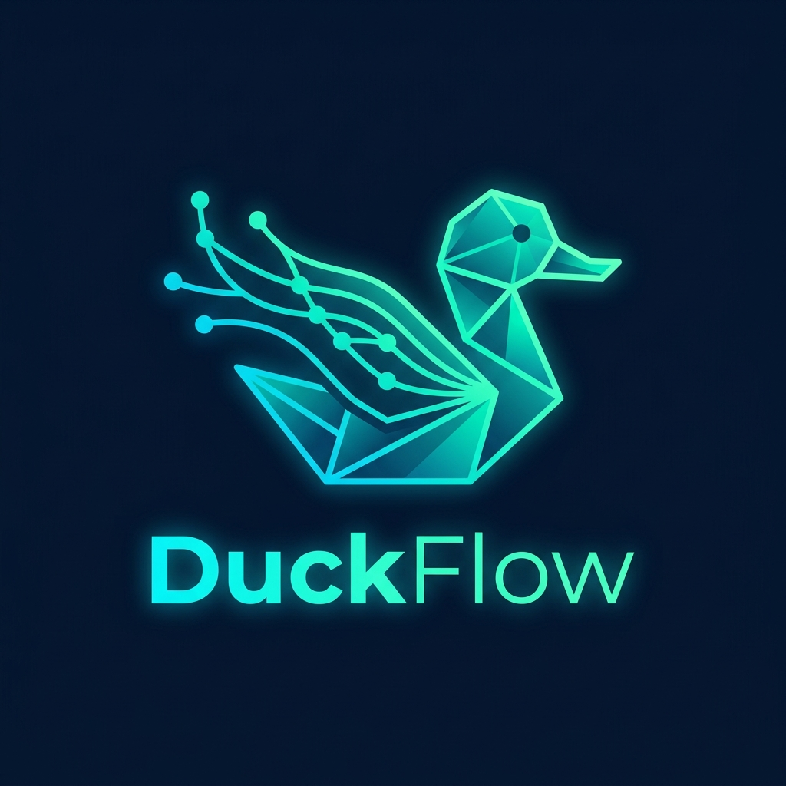
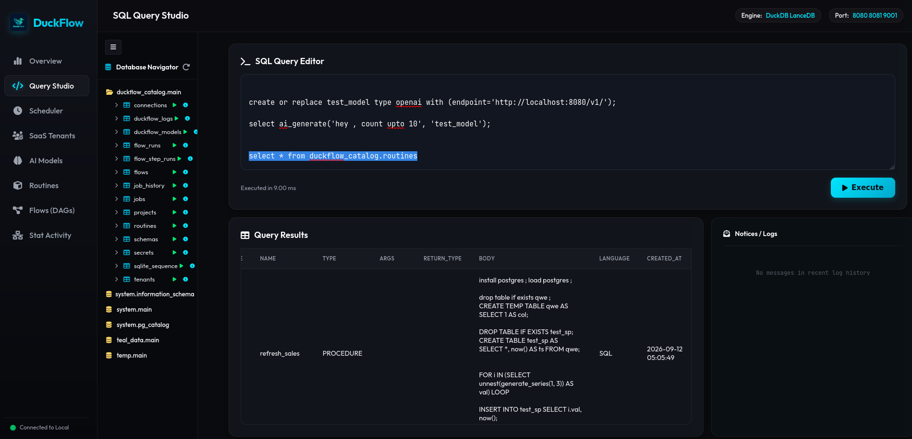
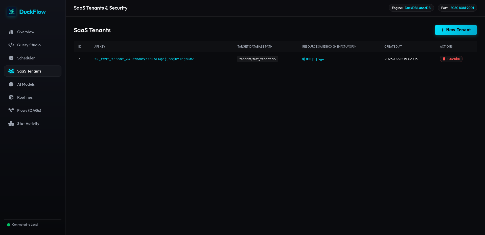
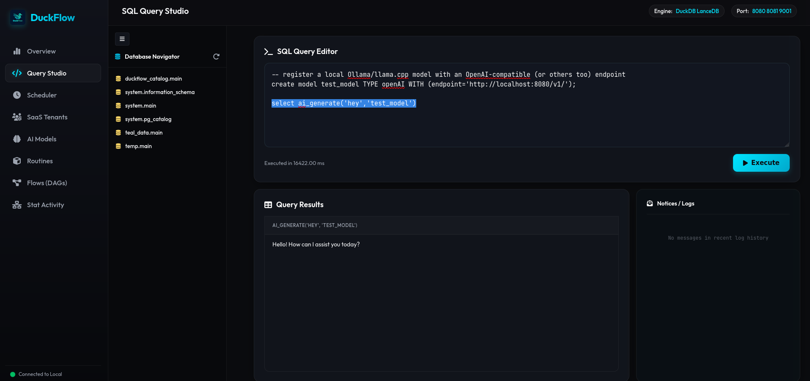
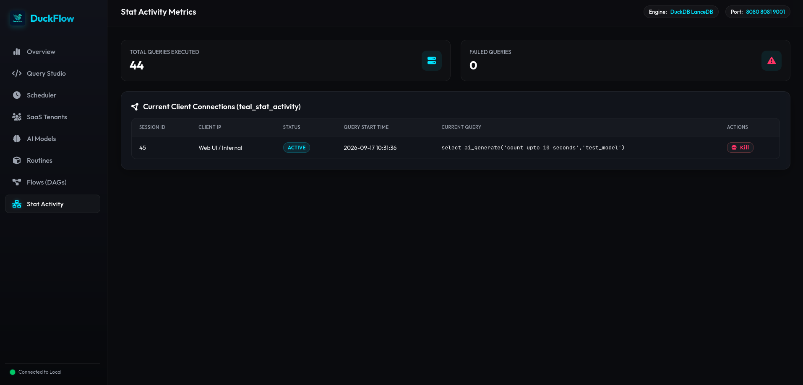

# DuckFlow

<div align="center">



<br><br>

<br><br>

  
  
  
  
</div>


DuckFlow is a high-performance Data Engineering Control Plane built on DuckDB. It adds PostgreSQL-like features (Stored Procedures, Functions, Background Jobs, and Distributed Clusters) and a native Web IDE to embedded databases.

## Deployment (Docker)

The fastest way to deploy DuckFlow is via Docker. This runs the platform and persists your data natively:

```bash
docker-compose up -d
```
- **Web UI & API**: `http://localhost:8081`

## Local Development

### Prerequisites
- CMake (3.15+)
- GCC / Clang (C++20 support)
- OpenSSL (`libssl-dev`)
- DuckDB shared library in `third_party/duckdb/`

### Build
```bash
./build.sh
```

### Run

**Single Node (Leader)**:
```bash
./run.sh
```

**Cluster Node**:
Spin up a secondary node that joins the leader on a separate port (9090).
```bash
./run.sh cluster
```

### Access Points
- **Web IDE**: `http://localhost:8081`
- **CLI**: `./build/teal-cli`


## License
Open-sourced under the [MIT License](LICENSE).


## Examples

some of the examples - 

---
 
---
 
---
 
---
